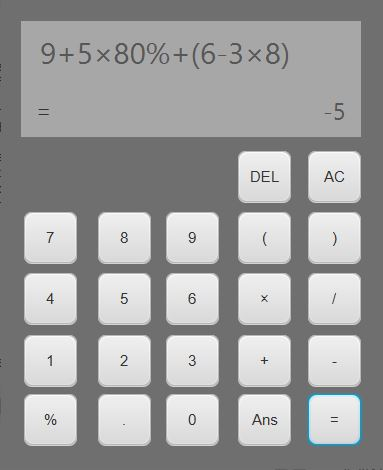

# **A JavaFx calculator program**

This calculator can perform any kinds of arithmetic calculation. Rules
of "Multiply, divide, then add and subtract" has been enforced. You can
add parentheses if you want. Any kinds of invalid math equation will not 
crash the program, "syntax error" or "math error" message will be display 
on the calculator.

